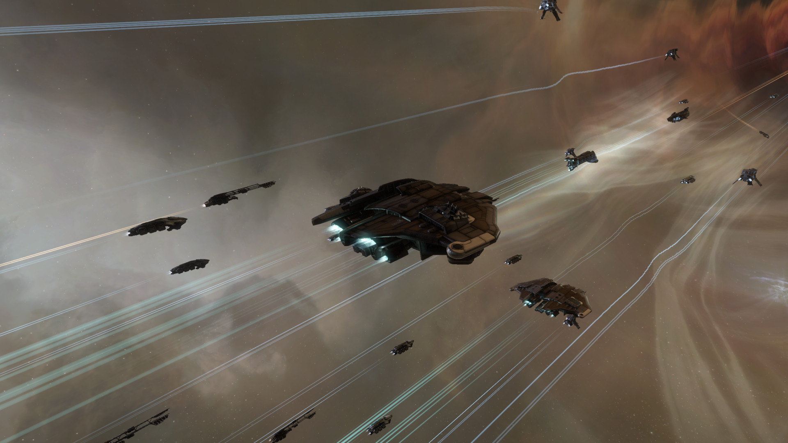

# Iridium Ops, an EVE Online player group

Warning! Website in active development.

Note: we are currently winning eve, but we might come back soonTM.

## Why Iridium Ops?

*Don't be a [Slave](https://everef.net/type/3721) of your CEO, join us in Iridium Ops. We will welcome you on our [Friend Ship](https://everef.net/type/34436), where we have plenty of [Exotic Dancers](https://everef.net/type/17765), [Wine](https://everef.net/type/42), [Spirits](https://everef.net/type/9850) and [Quafe](https://everef.net/type/3699)! In our spare time, when we are not shooting enemy ships or making ISK, we keep [Fedos](https://everef.net/type/26902) as our pets and we are willing to trade some for good intel on krabs, carebears and our enemies in null blobs of blue doughnut.*

### Still not convinced?

 - Freedom and friendly environment
 - Both new player and bitter vet friendly
 - Alpha friendly, no pressure to subscribe
 - No activity quotas, no CTAs, no mandatory OPs
 - No SP or alt requirements
 - No API required (regular members)
 - No taxes
 - EU & US time zones
 - ISK making tips and guidance
 - Infrastructure, custom tools and software, guides and resources
 - Multiple buybacks (PI, mission loot, salvage, ore, blueprints, LP) and other services
 - We are independent, not NullSec blob or part of blue donut
 - Minimal opsec, you will know what is actually going on
 - We fly our own ships and use more than just the F1 key.

### What we do?
 - PvE missions, ratting, abyss, exploration, mining
 - PvP daily fleets: small gangs and hunting, roams, gate camps
 - FW piracy
 - Trade
 - Planetary Interaction
 - We roam in LowSec, NullSec, sometimes WH

## Become a capsuleer

Is EVE Online something you would like to try? Then register via this link and get 1 million skill points for free. [Sign up to EVE Online](https://www.eveonline.com/signup/?invc=f34765ee-7bfe-4e83-b514-9b74dd62222b).

You can expect the best player driven content and economy as well as beautiful graphics regardless whether your are making ISK, flying solo or taking part in a large fleet.

